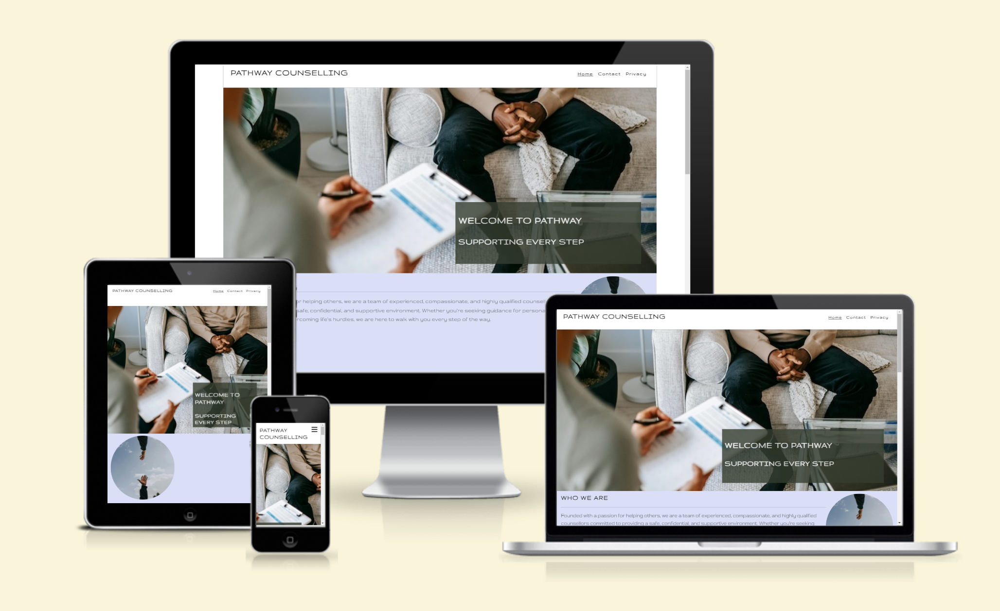

# Pathway Counselling services

## Website Overview

The Pathway counselling website is a site which offers different types of counselling services with industry professionals who will provide personalised tailored sessions to ensure the users needs are understood and met.  

Users of this website will be able to find information about us, diving deeper into who we are as a company, What our approach is, how we tailor our counselling services to meet the needs of the users, and why the users should choose us over other counselling websites.

Further down the page the users will be able to see what services are available to them with a one click button taking them to our contact page where they will be able to fill in a contact form to start their journey.

Towards the bottom of the site they will come across our privacy policy section where again they can click a one click button which will then take them to the privacy policy.

The site is responsive for all screen sizes.

## User Experience (UX)

-   ### User stories

    -   #### First Time Visitor Goals

        1. As a First Time therapy user, I want to know more about the company and what you do.
        2. As a First Time therapy user, I want to be able to easily navigate throughout the site to find out what types of therapy you offer.
        3. As a First Time therapy user, I want to know that the website is secure and that my personal information will be kept confidential.

    -   #### Returning Visitor Goals

        1. As a Returning Visitor, I want to be able to contact the company to book in a therapy session.
        2. As a Returning Visitor, I want to locate their social media links to see their followings on social media to determine how trusted and known they are.
        
    -   #### Frequent User Goals
        1. As a Frequent therapy user, I want to be able to book personalised therapy sessions depending on my needs at that time.
        

## Features
* Navigation Bar
    -   Featured at the top of all three pages, the navigation links are situated to the right.
    -  On larger screens they show the text; Home, Contact and Privacy. On smaller screens, such as mobiles, the navigation links are situated in the burger-icon that expands when you click it.

* The Header
    -  At the top left in the header section, there is a company name that will take the user to the home page when clicked.  
    -   I chose the font 'Gruppo' for the header and company name which I then inherited widely across the rest of the website. I felt that the font is a kind, soft font but also looks very professional.

* The Home page
    -   This is the landing page which shows the hero image of two people having a counselling meeting with the company slogan over the top. The company slogan has a dark green background which has an opacity of 0.8 with the slogan in white bold. This ensures that the text is clear and easy to read whilst also giving a calm relaxing vibe to the main page. I have used lavender, olive green, and dark green colours throughout the site to give it a calm and relaxing feel.  

    The section below is our about us section. This consists of 3 different areas, Who we are, our approach and why choose us.

    -   The section who we are explains who we are as a company and what we aim to provide. I have also included an image of 2 hands reaching out to each other as shown in the screenshot below.

    -   Our approach explains how we like to tailor each user's journey to ensure they get the best industry professional to suit the user's needs. This is accompanied by an image of 2 people having coffee together.

    - Why choose us? This explains that we have qualified counsellors who specify in different areas of counselling. This makes sure that the clients will get the best possible counseling based on their choice. This is accompanied by an image of 2 people having a meeting over a laptop.

* Services

- The services section is built up of 4 different cards each showing a different type of counselling service we provide. Underneath each title will be a short description of what that service covers, at the bottom of each card is a one click button which will then take you to the contact page.

The services included are as followed:

- Stress and Anxiety management.
- Grief and loss.
- Addiction and recovery support.
- Relationship issues.

* Privacy

- Below the services is a card which has a brief description of our privacy policy with a one click button which will take you to the privacy page. This will allow users to read the full privacy policy. This will help ensure that our users feel trusted when using our site as privacy is a key factor for any counselling body.

* The Footer

    -   The footer section includes relevant links to Facebook, Instagram and Youtube.
    -   The links will open in a new tab and encourage the user to take the next step.

* The Contact page

    -   The contact page consists of a short paragraph with reasons to contact us and why.
    -   Contact form that allows the user to fill in the necessary contact details to easily get in touch. They are also required to choose which service best suits the user.
    -   Submit button says Start your journey! Which is a friendly motivational message for the user to get in touch.

            

### Features left to implement

-   I chose to develop a counselling website for my first project as my mother has recently become a qualified counsellor and is in the process of setting up her own business and needs a website, therefore I will make the necessary changes when the time is right to make it her own.

## Testing

-   Accessibility

    -   I ran the pages through Lighthouse and confirmed that the colors and fonts are easy to read and that the site is accessible.

    

-   I tested and confirmed that the page works in different browsers; Chrome & Microsoft Edge.
-   I tested and confirmed that all internal links are working and redirecting the user between the pages.
-   I tested that all external links, to social media sites, are working and opening in a separate tab.
-   I tested and confirmed that the contact form works, all fields are required, the email field only accepts email address, and the submit button link works:

-   HTML
    -   No errors found when running the code through the [W3C HTML Validator](https://validator.w3.org/)

-   CSS
    -   No errors found when running the code through the [W3C CSS Validator](https://jigsaw.w3.org/css-validator/)
    

## Bugs

## I had three bugs whilst developing this project.

### Bug one

 the first being on the services section. I created the cards using Bootstrap and all were the same size but the buttons were in different positions. I tried debugging this myself using dev tools but was unsuccessful. After around 30 mins I contacted tutor support who were very helpful, they advised on a few things which may be the main cause of the issue. I tried these out and this worked. [Please see screenshot below for code used.]

### Bug two

- The second bug was a navbar bug. One day I noticed that when I clicked my nav bar the navbar options appeared half way down my page. I tried a few things to fix this by myself however I wasn't having any luck. I then contacted Tutor support who again were very helpful. It took them a little while to figure it out themselves however we soon figured out that I needed to add the below code to the navbar ID which fixed the issue.

* Code used to fix the bug.
top: 92px;
z-index: 1000;

### Bug three

- The third bug I encountered was another navbar bug. One day I noticed that the navbar was underneath the header and over the top of the hero image. I used devtools to debug this and soon realised that it was due to the display being relative when it should have been block.

### Unfixed bugs
-   No unfixed bugs

## Deployment

### Version Control

-   The site was created using Gitpod editor and pushed to Github to the remote repository 'milestone-project-1'.
-   Git commands were used throughout the development to push the code to the remote repository. The following git commands were used:
    -   git add . - to add the files to the staging area before being committed.
    -   git commit -m "commit message" - to commit changes to the local repository queue that are ready for the final step.
    -   git push - to push all committed code to the remote repository on Github.

### Deployment to Github pages

-   The site was deployed to Github pages as follows:
    -   In the Github repository, I navigated to Settings tab
    -   From the source section drop-down menu, I selected the Master branch and Save
    -   Once the Master branch was selected, the page provided the link to the website
-   The live link: [Pathway Counselling](https://rhain-u.github.io/milestone-project-1/)

### Cloning of the Repository Code locally

-   Go to the Github repository that you want to clone
-   Click on the Code button located above all the project files
-   Click on HTTPS and copy the repository link
-   Open the IDE of your choice and and paste the copied git url into the IDE terminal
-   The project is now created as a local clone

## Wireframes

-   The site was developed with the Mobile-first method before moving onto tablet then desktop. The wireframes were therefore drawn with that thought in mind, and created with [Balsamiq](https://balsamiq.cloud/snx9v5f/pmhksri/rB1D0). First pictures: Home page, Second pictures: Contact page, Third pictures: Privacy page.

### Mobile wireframes:

  

### Tablet Wireframes:

  

### Desktop Wireframes:

  

## Credits

- A special thanks to my Mentor for the support throughout milestone one.
- I would like to thank tutor support who have been a big help with some of the tricky bits
- Lastly I would like to Thank Rachel who has been keeping us up to date with regular weekly meetings and provided all the tools used to complete milestone one.

### Content

-   The icons in the footer and in the headings were taken from [Font Awesome](https://fontawesome.com/)  
The social media links to Facebook and Instagram are the real ones this company is using.
-   The Favicon in the Title of the page was taken from [Favicon](https://favicon.io/emoji-favicons/)
-   I took inspiration from the Love Running project to create the header, main content & footer and Bootstrap for the contact form and service section.
- The fonts I used were from [Google fonts] (https://fonts.google.com/)
- I used Chat GPTfor the content e.g. About us paragraphs and service cards. [Chat-GPT] (https://chatgpt.com/)

### media

-   The images in the hero section, on the services page and the contact page was taken from [Unsplash](https://unsplash.com/) and [Pexels] (https://www.pexels.com/)

### Artist recognition
- All artwork taken from [unsplash] Artists work used as listed:
- Dylan Ferreira
- Jarl Schmidt
- Justin Follis
- Lance-Reis
- Alex [Pexels]
- Priscilla Du
- Youssef

